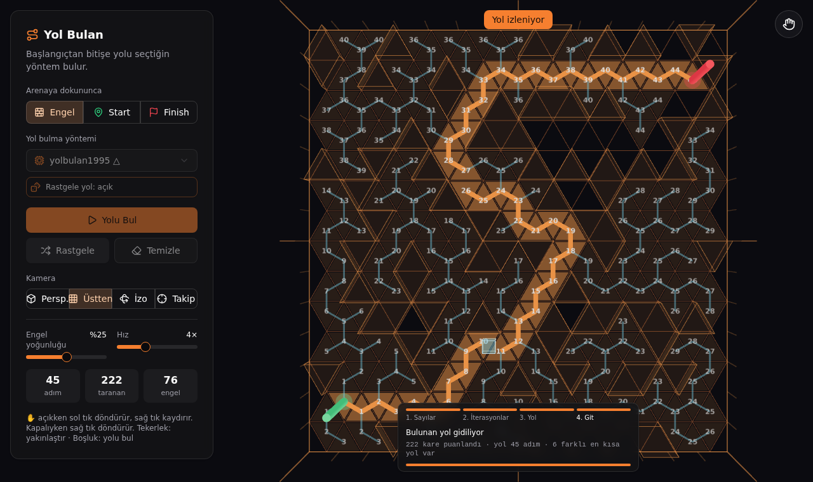

# r3f-yolbulan

React Three Fiber + shadcn/ui ile 3B yol bulma demosu: yarı saydam mavi küp, yeşil **START** direğinden kırmızı **FINISH** direğine en kısa yolu bulup yuvarlanarak gider.

## ▶ Demo

- **Hemen dene (Claude Artifact):** https://claude.ai/artifact/PfrVNqNe26cQqgq2Xg3VfY
- **GitHub Pages:** https://billylz.github.io/r3f-yolbulan/ (Settings → Pages → Source: *GitHub Actions* açıldıktan sonra çalışır)

<p>
  
  
</p>

## Kullanım

- **Engel / Start / Finish**: arenaya dokununca ne yapılacağını seç.
  - Engel: engel koy/kaldır (fareyle sürükleyerek çizebilirsin)
  - Start: yeşil başlangıç direğini o kareye taşı
  - Finish: kırmızı bitiş direğini o kareye taşı
- **Yol bulma yöntemi**: açılır listeden seç.
  - **A\***: Manhattan sezgiseliyle en kısa yolu garanti eder.
  - **yolbulan1995**: her kareye puan verir. Start = 0, 0'ın boş komşularına 1, 1'lerin komşularına 2… Engellere puan verilmez; Finish puan alınca durur. Yol, Finish'ten her adımda bir küçük puana gidilerek bulunur.
    - Çalışma dört aşamada gösterilir:
      1. **Sayılar**: bütün puanlar dalga dalga yazılır (0, 1, 2 …).
      2. **İterasyonlar**: her iterasyon **Hız** ayarına göre oynatılır (saniyede 40 × Hız): işlenen kare mavi çerçeveli, denenen her adım mavi bir dal olarak büyür.
      3. **Yol**: bulunan yol Finish'ten Start'a adım adım turuncu çizilir.
      4. **Git**: küp yolu yürür.
    - Alttaki panel hangi aşamada olunduğunu, o anki işlemi ve ilerlemeyi gösterir; **Atla** o aşamayı geçer.
    - **Rastgele yol** (varsayılan açık): aynı uzunlukta birden çok yol varsa her seferinde farklısını bulur. Kareler ve komşular karışık sırayla denenir, geri izlemede uygun komşulardan rastgele biri seçilir. Kapalıyken hep aynı yol bulunur. Bitişte kaç farklı en kısa yol olduğu da yazılır.

    
  - **yolbulan1995 △**: aynı puanlama kuralı, ama zemin **üçgenlerden** oluşur. Her üçgenin kenar paylaştığı 3 komşusu vardır; puanlar, dallar ve yol üçgenden üçgene ilerler. Bu yöntem seçilince zemin, engeller, Start ve Finish üçgen ızgaraya göre yeniden kurulur; başka bir yönteme geçince kareye döner.

    
- **Yolu Bul**: seçili yöntemle Start → Finish yolunu arar, taranan kareleri gösterir, sonra mavi küp yolu izler. (Boşluk/Enter da çalışır.)
- **Rastgele**: seçili yoğunlukta, her zaman çözülebilir rastgele engeller.
- **Temizle**: tüm engelleri siler.
- **Engel yoğunluğu / Hız**: rastgele haritanın doluluğu ve küpün hızı.
- **Kamera görünümleri**: Perspektif · Üstten · İzometrik · Takip (kamera küpü izler). Seçili görünüme tekrar dokunmak o açıya sıfırlar.
- **✋ (sağ üst)**: parmakla kamera kontrolü.
  - Açık: 1 parmak / sol tık döndürür, 2 parmak yakınlaştırır ve kaydırır (pan), sağ tık kaydırır.
  - Kapalı: dokunmak arenayı düzenler; 2 parmak yine yakınlaştırır ve kaydırır, sağ tık döndürür.

## Geliştirme

```bash
npm install
npm run dev           # geliştirme sunucusu
npm run build         # dist/ (GitHub Pages)
npm run build:single  # dist-single/index.html — tek dosya, her yerde açılır
npm test              # algoritma ve geometri testleri
```

Arayüz bileşenleri `src/components/ui/` altında (shadcn/ui, Tailwind v4).

Yeni bir yol bulma yöntemi eklemek için `src/algorithms/` altına `(grid, walls, start, goal) => { visited, path }` imzalı bir fonksiyon yaz ve `src/algorithms/index.js` içindeki `METHODS` listesine hangi zeminde çalıştığıyla (`grid: 'square'` ya da `'tri'`) ekle. Zeminler `src/grids.js` içinde: her biri komşuları, kareyi/üçgeni dünyada nereye koyacağını ve dış hatlarını bilir. `methods.test.js` her hazır yöntemin kendi zemininde geçerli bir yol döndürdüğünü otomatik test eder.
