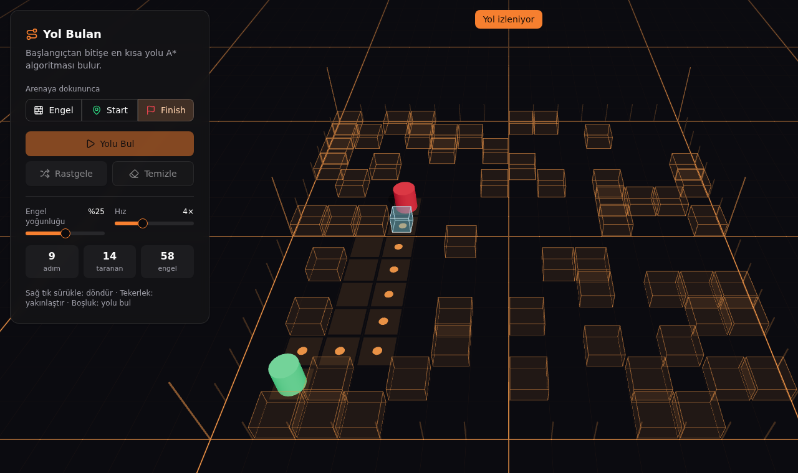
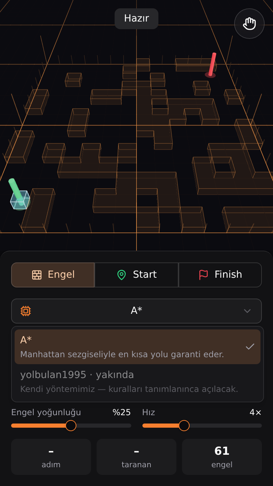
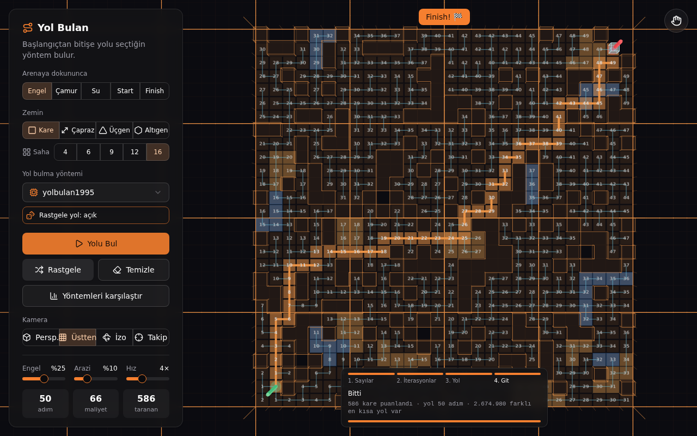
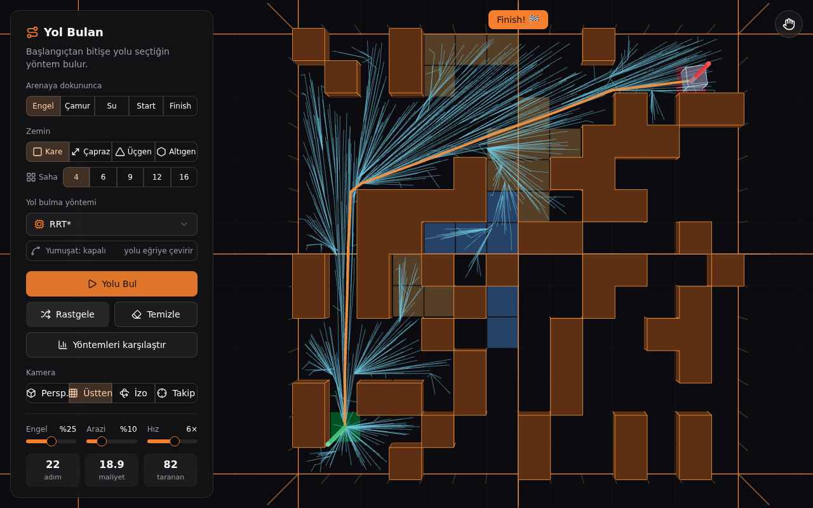
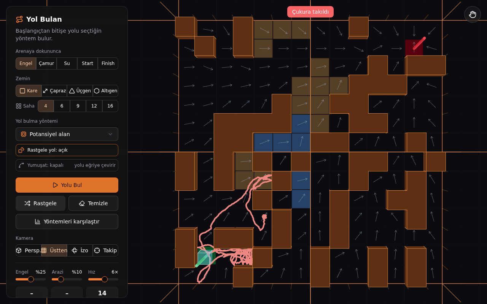
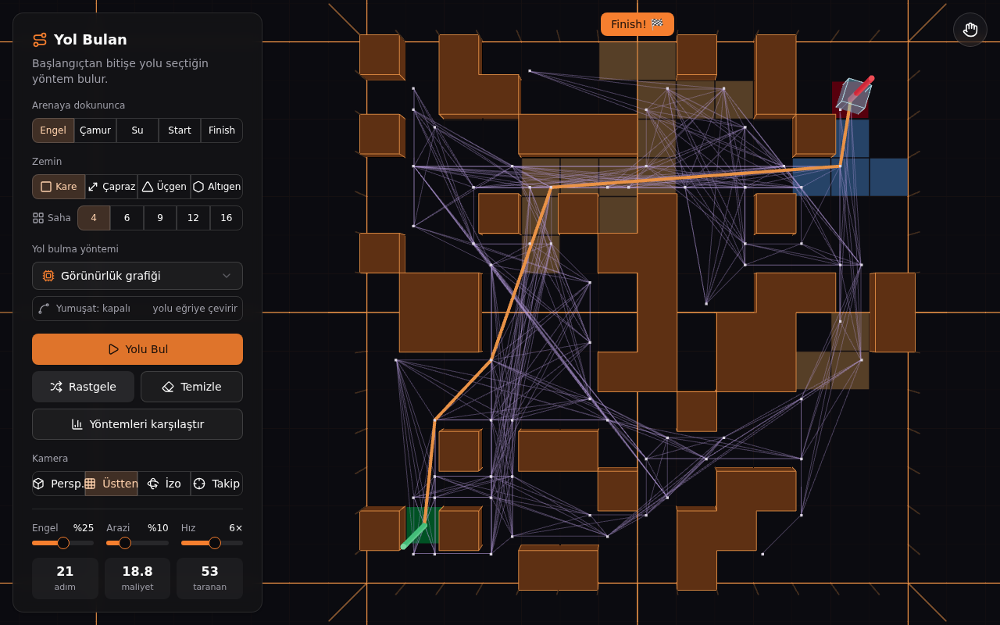
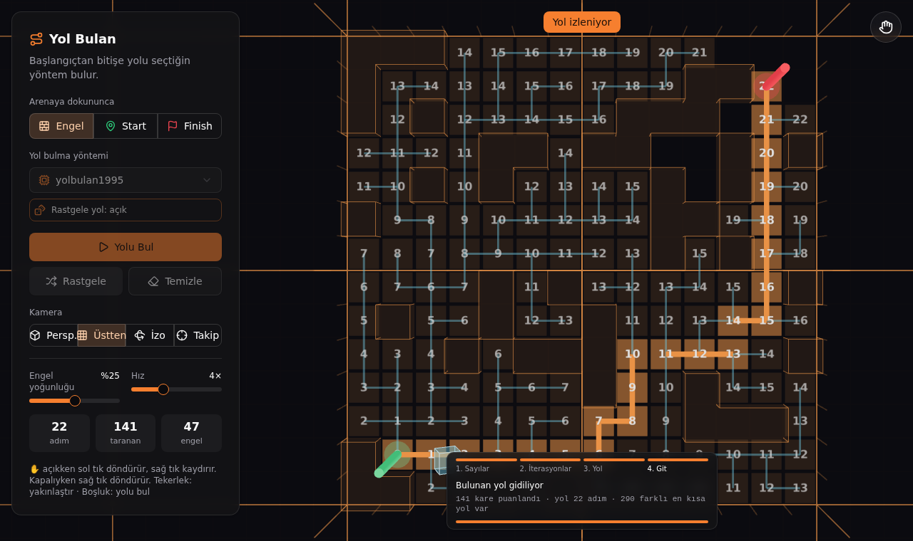
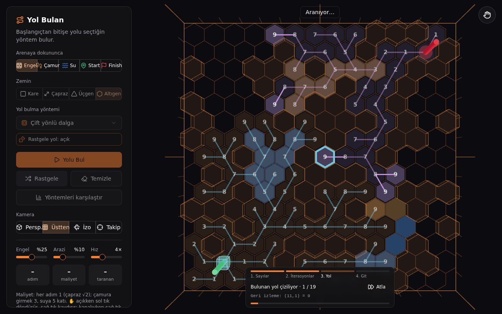
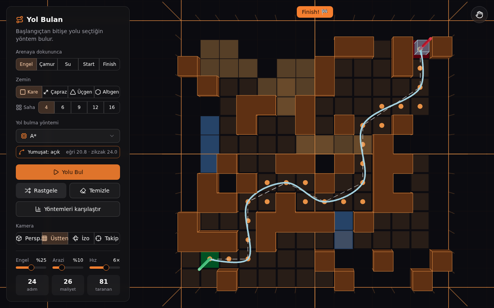
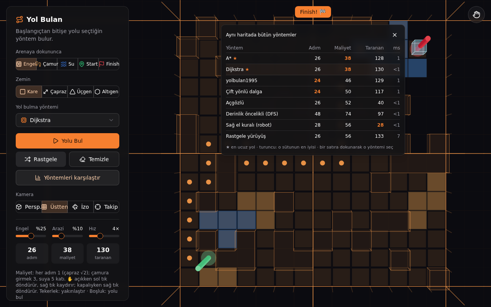

# r3f-yolbulan

React Three Fiber + shadcn/ui ile 3B yol bulma laboratuvarı: 14 yöntem, 4 zemin, çamur ve su. Yarı saydam mavi küp, yeşil **START** direğinden kırmızı **FINISH** direğine seçilen yöntemin bulduğu yolu yürür.

## ▶ Demo

**https://billylz.github.io/r3f-yolbulan/**

<p>
  
  
</p>

### Harita linki

Bir haritayı link olarak paylaşabilirsin: **Paylaş** butonu telefonda paylaşım menüsünü (WhatsApp, mesaj…) açar, bilgisayarda o anki haritanın linkini panoya kopyalar. Link elle de yazılabilir; harita adresin `#` işaretinden sonrasına yazılır:

```
https://billylz.github.io/r3f-yolbulan/#kare:S010012L00010001L100100203F
```

- Her karakter bir hücre: **0** boş, **1** engel, **2** su, **3** çamur, **S** Start, **F** Finish (S ve F yazılmazsa varsayılan köşeler kullanılır).
- **L** yeni satır; satırlar Üstten görünümde yukarıdan aşağıya.
- Baştaki zemin adı isteğe bağlı: `kare:` (varsayılan), `capraz:`, `ucgen:`, `altigen:`.
- Saha büyüklüğü koddan anlaşılır: ilk satırın uzunluğu ve satır sayısı kodu alan en küçük saha (4–16 büyük kare) seçilir. Yazılmayan hücreler boştur.

## Zeminler

| Zemin | Komşu | Not |
| --- | --- | --- |
| **Kare** | 4 | sağ, sol, ileri, geri |
| **Çapraz** | 8 | çapraz adım √2 tutar; iki engelin köşesinden çapraz geçilmez |
| **Üçgen** | 3 | kenar paylaşan üçgenler |
| **Altıgen** | 6 | oyunların sevdiği zemin |

Zemin değişince Start, Finish, engeller ve arazi o zemine göre yeniden kurulur.

### Saha büyüklüğü

Zemindeki turuncu çizgiler sahayı **büyük karelere** böler (her biri 7 × 7 küçük kare). **Saha** seçicisiyle 4 (2 × 2), 6 (3 × 2), 9 (3 × 3), 12 (4 × 3) ya da 16 (4 × 4) büyük kare seçilebilir; 16'da saha 28 × 28 küçük karedir. Üçgen, altıgen ve çapraz zeminler de aynı alana büyür; kamera sahayı sığacak şekilde uzaklaşır. Büyük sahalarda yolbulan1995'in sayılar ve yol aşamaları yine en fazla 1,5 saniye sürer; iterasyonlar Hız ayarına göre oynar.



## Yöntemler

| Yöntem | Ne yapar | En kısa yol? |
| --- | --- | --- |
| **A\*** | Hedefe yönelerek arar | ✓ en ucuz (çamur/su dahil) |
| **Dijkstra** | Her yöne eşit yayılır | ✓ en ucuz (çamur/su dahil) |
| **yolbulan1995** | Start = 0, komşulara 1, 2, 3… puan verir; Finish'ten geriye iner | ✓ en az adım |
| **Çift yönlü dalga** | Start'tan ve Finish'ten iki dalga yayılır, ortada buluşur | ✓ en az adım |
| **Jump Point Search** | Çapraz zeminde A*: düz ve çapraz çizgiler boyunca atlar (sadece Çapraz zemin) | ✓ en kısa mesafe |
| **Açgözlü** | Hep hedefe en yakın görünen kareye gider | ✗ hızlı ama uzayabilir |
| **Derinlik öncelikli (DFS)** | Bir yöne gidebildiği kadar gider, çıkmazda geri döner | ✗ dolambaçlı |
| **Sağ el kuralı (robot)** | Hedefe yürür; engele çarpınca sağ elini duvardan ayırmadan dolaşır | ✗ bazen bulamaz |
| **Rastgele yürüyüş** | Rastgele dolaşır; küp döngüleri silinmiş yolu yürür | ✗ bazen bulamaz |

### Her açıya giden yöntemler

Bu beşi kareden kareye değil, sahada her yöne gider; yolları turuncu bir çizgidir ve küp üzerinde kayar. Maliyetleri yolun uzunluğudur (bir adım = iki komşu hücre merkezi arası); çamur ve suyu dikkate almazlar.

| Yöntem | Ne yapar | Ekranda |
| --- | --- | --- |
| **Theta\*** | A\* gibi arar, ama bir hücre engelsiz gördüğü uzak bir hücreye doğrudan bağlanır | birkaç düz çizgi; hücre-hücre en kısa yoldan hiçbir zaman uzun değil |
| **Görünürlük grafiği** (Lozano-Pérez & Wesley, 1979) | En kısa yol yalnızca engel köşelerinde kırılır: Start, Finish ve engellerin dışa bakan köşeleri (biraz dışarı alınmış) düğüm olur, birbirini engelsiz gören düğümler bağlanır, bu grafikte Dijkstra ile en kısa yol seçilir | köşelerde beyaz noktalar, mor görünürlük çizgileri, yolun kırıldığı noktalarda ince mor direkler; genelde Theta*'tan da kısa |
| **Potansiyel alan** | Finish çeker, engeller ve kenarlar iter; küp kuvvetlerin toplamı yönünde kayar. Bir çukura takılırsa birkaç kez rastgele sarsılarak çıkmayı dener | her hücrede kuvvetin yönünü gösteren gri oklar; takılırsa iz kırmızı ve "Çukura takıldı" |
| **RRT** | Start'tan rastgele noktalara doğru kısa dallar uzatan ağaç; bir dal Finish'i görünce durur | mavi ağaç büyür; yol zikzaklıdır |
| **RRT\*** | RRT, ama büyümeye devam eder: her yeni dal en ucuz komşuya bağlanır ve komşularını kendi üzerinden yeniden bağlar | ağaç düzenlenir, yol kısalır |

**Yumuşat** bunlarla da çalışır (özellikle RRT'nin zikzak yolunu düzeltir).

<p>
  
  
</p>



**yolbulan1995** ve **Çift yönlü dalga** dört aşamada oynatılır:
1. **Sayılar**: bütün puanlar dalga dalga yazılır (çift yönlüde Start tarafı turuncu, Finish tarafı mor).
2. **İterasyonlar**: her iterasyon **Hız** ayarına göre (saniyede 80 × Hız) oynatılır; işlenen kare mavi çerçeveli, denenen her adım bir dal olarak büyür.
3. **Yol**: bulunan yol Finish'ten Start'a adım adım çizilir.
4. **Git**: küp yolu yürür.

Alttaki panel aşamayı ve o anki işlemi gösterir; **Atla** o aşamayı geçer. **Rastgele yol** açıkken eşit uzunluktaki yollardan her seferinde farklısı bulunur ve kaç farklı en kısa yol olduğu yazılır.

<p>
  
  
</p>

## Yumuşat (spline)

**Yumuşat** anahtarı her yöntemde ve her zeminde çalışır; bulunan yolu bir eğriye çevirir:

1. **İp germe**: yolda aralarında engel olmayan noktalar doğrudan bağlanır, gereksiz köşeler atılır. Küp duvar köşelerine sürtünmesin diye küçük bir pay bırakılır; yolun kaçındığı çamur ve suyun içinden kestirme yapılmaz.
2. **Catmull-Rom spline**: kalan köşelerden eğri geçirilir. Eğri bir yerde engele değecekse gerilmiş düz yol kullanılır.

Ekranda orijinal zikzak yol kalır; gerilmiş yol beyaz kesik çizgi, eğri açık mavi çizgidir. Küp eğri üzerinde, gittiği yöne dönerek kayar. Anahtarın yanında eğrinin ve zikzak yolun uzunluğu yazar.



## Arazi ve maliyet

Her adım 1 tutar (çapraz adım √2). **Çamur**a girmek 3, **su**ya girmek 5 katı tutar. A\* ve Dijkstra en ucuz yolu bulur; diğerleri araziyi dikkate almaz. Panelde yolun **adım**, **maliyet** ve **taranan** kare sayısı görünür.

## Karşılaştırma

**Yöntemleri karşılaştır**, bu zeminde çalışan bütün yöntemleri aynı haritada çalıştırır ve adım, maliyet, taranan kare ve süreyi yan yana gösterir. ★ en ucuz yolu, turuncu her sütunun en iyisini işaretler. Bir satıra dokunmak o yöntemi seçer.



## Kullanım

- **Arenaya dokununca**: Engel · Çamur · Su (sürükleyerek boyanır) · Start · Finish.
- **Durdur**: arama, oynatma ya da yürüyüş sürerken **Yolu Bul** butonu **Durdur**'a dönüşür (telefonda panel kapalıyken altta **Durdur** düğmesi, klavyede **Esc**). Görüntü olduğu yerde kalır, küp bulunduğu adımı bitirip durur.
- **Rastgele**: seçili yoğunlukta engel ve arazi (her zaman çözülebilir). **Temizle**: hepsini siler.
- **Engel / Arazi / Hız**: rastgele haritanın doluluğu ve oynatma hızı. Hız 1–10 (varsayılan 6): iterasyonlar saniyede 80 × Hız, küp saniyede 2 × Hız kare.
- **Kamera**: Perspektif · Üstten · İzometrik · Takip (küpü izler). Seçili görünüme tekrar dokunmak o açıya sıfırlar.
- **Telefonda** **Yolu Bul**'a basınca alttaki panel aşağı kayar, ekranda sadece sahne kalır. Alttaki **Panel ▲** düğmesine dokununca (ya da yukarı kaydırınca) panel geri açılır; panelin üstündeki tutamaçla elle de kapatılabilir.
- **✋ (sağ üst)**: açıkken 1 parmak / sol tık döndürür, 2 parmak yakınlaştırır ve kaydırır. Kapalıyken dokunmak arenayı düzenler; 2 parmak yine çalışır.

## Geliştirme

```bash
npm install
npm run dev           # geliştirme sunucusu
npm run build         # dist/ (GitHub Pages)
npm run build:single  # dist-single/index.html — tek dosya, her yerde açılır
npm test              # algoritma, zemin ve geometri testleri
```

- `src/grids.js`: zeminler. Her zemin komşularını, hücrenin dünyadaki yerini ve dış hattını bilir.
- `src/algorithms/`: yöntemler. Hepsi `(grid, walls, start, goal, { costs, random }) => { visited, path }`; `index.js` içindeki `METHODS` listesine eklenir. `methods.test.js` her yöntemi desteklediği her zeminde çamur ve su ile çalıştırır; yolun geçerli olduğunu ve "en kısa" iddiasını doğrular.
- `src/replay.js`: adım kaydeden yöntemlerin aşamalı oynatması.
- `src/smooth.js`: ip germe ve Catmull-Rom spline (Yumuşat).
- `src/mapcode.js`: harita linki (kodlama ve okuma).
- `src/components/ui/`: shadcn/ui bileşenleri (Tailwind v4).
